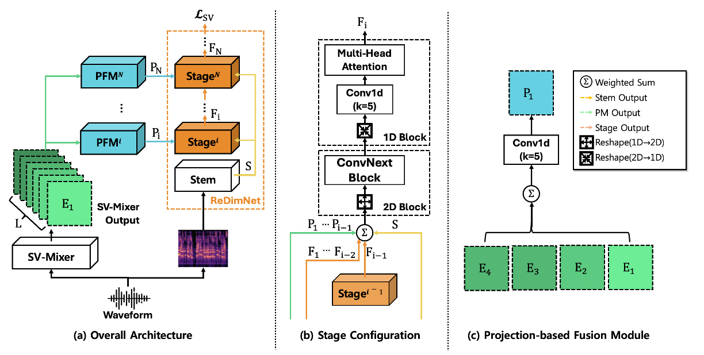

<!-- [](https://colab.research.google.com/drive/1_zGof1NGM5WgZ5sJtQfsy1D7rKq9RwxR?usp=sharing) -->

# SSRFNet : Stage-wise SV-Mixer and RedimNet Fusion Network for Speaker Verification

> [📄 Paper: *SSRFNet : Stage-wise SV-Mixer and RedimNet Fusion Network for Speaker Verification*](./assets/paper.pdf)  
> 📅 Conference: IEEE ICASSP 2026 (submitted)  
<!-- > 🚀 **Now available on [PyTorch Hub](https://colab.research.google.com/drive/1_zGof1NGM5WgZ5sJtQfsy1D7rKq9RwxR?usp=sharing)!**   -->
<!-- > (Load pretrained **SSRFNet-Mixer** models in just one line of code) -->

---


## 🔍 Overview
SSRFNet (Stage-wise SV-Mixer and ReDimNet Fusion Network) is a lightweight framework for speaker verification that integrates spectrogram features with hidden states from pre-trained models (PTMs). Unlike prior studies, SSRFNet retains spectrograms as the main input and progressively injects PTM hidden states through a Projection-based Fusion Module (PFM). This stage-wise strategy ensures efficient and compatible integration, achieving strong accuracy with far fewer parameters than conventional fusion method

---

## 🧠 Key Contributions
1.	Stage-wise Feature Fusion Stratgey — Gradually integrates PTM hidden states into ReDimNet to enrich spectrogram features efficiently.
2.	Projection-based Fusion Module (PFM) — Resolves feature space mismatch with a lightweight projection mechanism.
3.	Efficient Hybrid Design — Combines SV-Mixer and ReDimNet to achieve high accuracy with only 74.2M parameters.
---

## 🏗️ Architecture

The SSRFNet pipeline consists of:

1. **SV-Mixer Encoder Blocks** (12 layers, 1024 hidden dimension)
2. **SSRFNet** (based on [ReDimNet](https://github.com/IDRnD/redimnet))


<!-- 
---

## 📊 Experimental Results


--- -->

## ⚙️ Setup (Optional)

### 🐳 Docker (Recommended)

This project is designed to run inside a Docker container.

- The [`Dockerfile`](./assets/setup/Dockerfile) defines the full environment with CUDA and PyTorch support.
- Use the provided shell scripts ([`build.sh`](./assets/setup/build.sh), [`launch.sh`](./assets/setup/launch.sh)) to build and launch the container:

⚠️ **Important:** You **must** edit `{PATH_Dockerfile}` in [`build.sh`](./assets/setup/build.sh) before running.

```bash
# Build Docker image
./build.sh

# Launch container
./launch.sh
```

### 🛠 Manual Installation

For users who prefer **not to use Docker**, two options are provided:

- [`requirements.txt`](./assets/setup/requirements.txt): full environment with all dependencies (recommended for development and training)
- [`cleaned_requirements.txt`](./assets/setup/cleaned_requirements.txt): minimal environment for inference or lightweight usage

Install either one using:

```bash
# Full environment
pip install -r assets/setup/requirements.txt

# OR: Minimal setup
pip install -r assets/setup/cleaned_requirements.txt
```

## 🔧 Usage


### How to Train (Full Pipeline)

Train a SSRFNet from scratch using WavLM knowledge distillation, and evaluate it on VoxCeleb1-O datasets. 

➝ Go to [`📁experiments/train`](./experiments/train/README.md)


## 📎 Citation

```bash
# SSRFNet
This repository contains official pytorch implementation for “SSRFNET : STAGE-WISE SV-MIXER AND REDIMNET FUSION NETWORK FOR SPEAKER VERIFICATION” paper.
```

## 🛡️ License

This project is licensed under the MIT License – see the LICENSE file for details.
